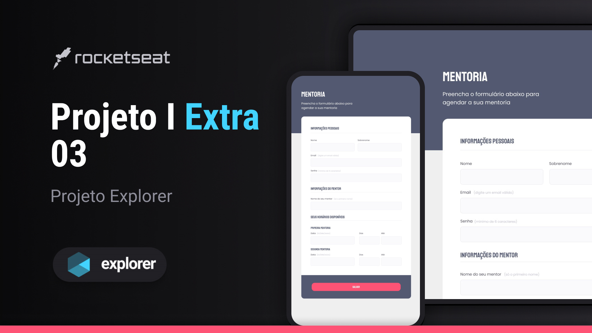

<h1 align="center"> 👨🏼‍💻Projeto Extra 03 I Explorer 
  🚀👨🏼‍🚀#Desafios Rocketseat </h1>
 

  ⚠️ <strong>ATENÇÃO</strong> ⚠️
   
  Este é um projeto conceitual e não representa uma empresa ou serviço real.  
  Ele foi criado com o propósito de ser adicionado ao meu portfólio, demonstrando minhas habilidades e capacidades em projetos de design e desenvolvimento.  
  <a href="https://rocketforms.typeform.com/to/fPcSmBp9#referral_id=e8eb53b2-1777-4867-9b33-d468fc9d1422o">Estude projetos como este em formato de vídeo clicando aqui!</a>

  <a href="#-tecnologias">Tecnologias</a>&nbsp;&nbsp;&nbsp;|&nbsp;&nbsp;&nbsp;
  <a href="#-projeto">Projeto</a>&nbsp;&nbsp;&nbsp;|&nbsp;&nbsp;&nbsp;
  <a href="#-layout">Layout</a>&nbsp;&nbsp;&nbsp;

 

  

## 🚀 Tecnologias

Esse projeto foi desenvolvido com as seguintes tecnologias:

- HTML e CSS
- Git e Github
- Figma

## 💻 Projeto

O Projeto Extra 03, é um formulário para uma empresa, cujo seu objetivo é a captação de dados do cliente para agendar um horário com um mentor. Já que a mesma oferece exclusividade,tendo diversos tipos de mentorias e mentores e que são escolhidos de acordo com a preferência,necessidade e horário disponíveis do cliente.
Este projeto é dividido em 3 etapas de preenchimento:

- <strong> Informações pessoais</strong>  

    Contém 4 campos de preenchimento  
    ( Sendo 2 do tipo name,1 do tipo text & 1 do tipo password )

- <strong> Informações do mentor</strong>  

    Contém 1 campo de preenchimento  
    ( Sendo ele do tipo name )

- <strong> Seus horários disponíveis</strong>  

  Contém 6 campos de preenchimento no total,dividos em 3 na "Primeira mentoria" e os outros 3 na "Segunda mentoria".  
  ( Sendo 1 de tipo date & 2 do tipo time...begin/end )

## 🔖 Layout

Você pode visualizar o layout do projeto através [DESSE LINK](https://www.figma.com/file/9wRtVUDou8X5tqkHYb1jdj/Stage-03---Formul%C3%A1rio-intermedi%C3%A1rio-(Copy)?node-id=0%3A1&mode=dev).   <strong>OBS:</strong> É necessário ter conta no [Figma](https://figma.com) para acessá-lo.

😉 Feito com ♥ by Pablo Perdigão, aluno Explorer da Rocketseat!  
📲 [Participe da comunidade Rocketseat!](https://discord.gg/rocketseat)
